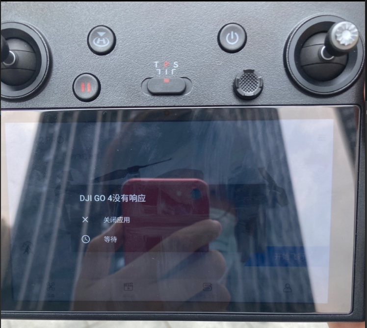

# Dji Go 4
> All the error come from Dji Go 4 and all the devices belong to me, this is not a repo to collections of Dji Go 4, just for me
> to record the reason of my device

## DJI GO 4 

**v4.3.42(4381)**
> 2021-06-08 SZ
> DJI Go 4 run on smart controller which always no response

**The reason**

I have no idea what going on here,but there may several keys relevant to:

* I check the temperature is 47.6(degrees centigrade) inside the group of battery, so I guess that the smart controller with screen on the same level, this may be the reason why the software no response

And the I find the same issue like this from (bbs of dji)

* The issue pushed on 2019-5-26 https://bbs.dji.com/forum.php?mod=viewthread&tid=219396&page=1#pid4044645

* and the end-user reply that this is an issue did not fix by DJI and relevant to the working environment temperature, but may not sure the scope of working space temperature

* and the end-user specific mentioned that the work environment should far away to the downtown due to other perturbation

* the services of DJI let user push their controller's logs under `/sdcard/DJI/dji.go.v4/LOG/CRASH` but I do not have log of crash, but no result after the analysis

**Conclusion**

I guess there may have a product flaw in hardware, so I not sure this can be solved by DJI. And we should keep away from the high temperature working environment and downtown. That can help to decrease this situation.